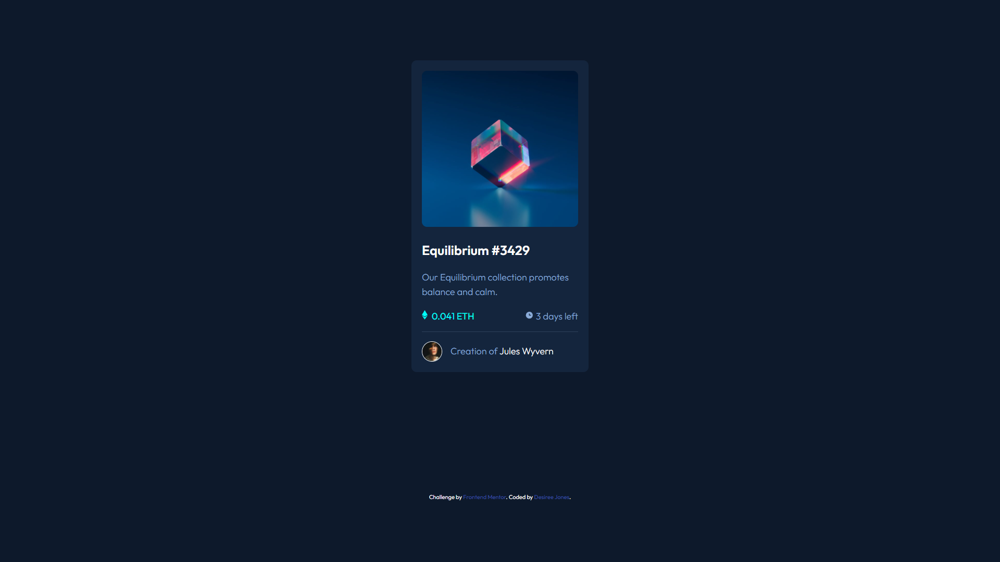

# Frontend Mentor - NFT preview card component solution

This is a solution to the [NFT preview card component challenge on Frontend Mentor](https://www.frontendmentor.io/challenges/nft-preview-card-component-SbdUL_w0U). Frontend Mentor challenges help you improve your coding skills by building realistic projects. 


## Table of contents

  - [The challenge](#the-challenge)
  - [Screenshot](#screenshot)
  - [Links](#links)
  - [Built with](#built-with)
  - [Useful resources](#useful-resources)
  -  [Author](#author)


### The challenge

Users should be able to:

- View the optimal layout depending on their device's screen size
- See hover states for interactive elements


### Screenshot




### Links

- Solution URL: [here](https://www.frontendmentor.io/solutions/nft-preview-card-component-S1ERU1aE5)
- Live Site URL: [here](https://desi-j.github.io/nft-preview-card-component/)


### Built with

- Semantic HTML5 markup
- Flexbox
- Mobile-first workflow


### What I learned

The hover effect on the image was especially difficult. However I found the html structure that I will be using from now on to create an the same effect. 

```html
<div class="img-wrapper">
  
  <div class="overlay">
    <svg class="hover-icon"></svg>
  </div>
</div>
```


Inset is a css property that is shorthand for top, right, bottom , left. By setting inset: 0; the overlay class sticks to all 4 sides of it's parent container. Overlay class must have a width of 100%

```css
.overlay {
  position: absolute;
  inset: 0;
  bottom: 10px;
  border-radius: 10px;
  transition: 500ms ease;
}
```

### Useful resources

- [How To Create An Image Hover Effect With CSS](https://www.youtube.com/watch?v=tF3RE5CGt9U) - This helped me for the hover effect. I really liked this pattern and will use it going forward.


## Author

<!-- - Website - [Add your name here](https://www.your-site.com) -->
- Frontend Mentor - [@Desi-J](https://www.frontendmentor.io/profile/Desi-J)


